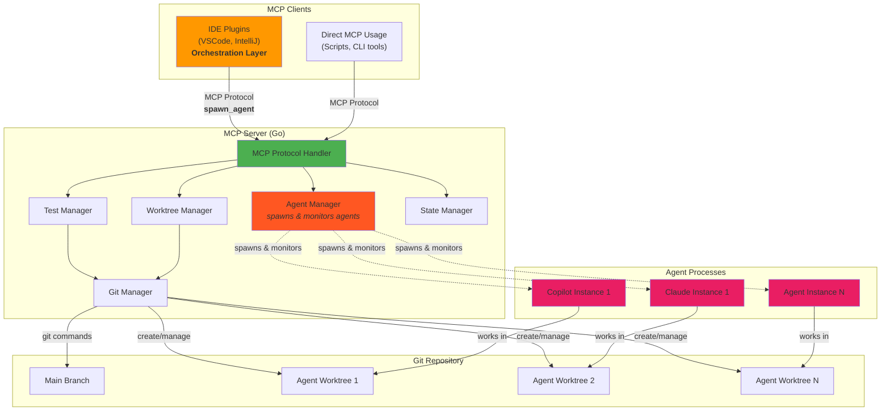

# Architecture

## System Overview



**Flow:** Client calls MCP tool → Server orchestrates use case → Domain logic + Infrastructure execute → Return result

## Workflows

**MVP (Current):**
1. MCP client calls `create_worktree(sessionId)` → Server creates worktree + branch
2. Agent works in isolated worktree
3. Developer reviews manually: `cd .worktrees/agent-{sessionId} && git diff`
4. Developer merges manually or via `merge_to_main(sessionId)`
5. Cleanup with `remove_worktree(sessionId)`

**Future (Orchestration):**
1. CLI/IDE calls `spawn_agent()` → Server creates worktree + spawns agent process
2. Agent works autonomously, server monitors status
3. Developer polls status via CLI/IDE
4. Developer reviews in IDE, merges via UI
5. Server terminates agent process and cleans up

## Design Principles

- **Protocol-First:** All functionality via MCP tools, usable by any client
- **Human-in-the-Loop:** Critical operations require human approval
- **Process Isolation:** Each agent gets dedicated worktree + process
- **Progressive Enhancement:** MVP → Full orchestration

---

## Clean Architecture

### Layer Organization

Dependencies flow **inward** toward the domain:

```
Adapters (MCP handlers, CLI)
    ↓ depends on
Application (Use Cases: CreateWorktree, RunTests, MergeToMain)
    ↓ depends on
Domain (Entities: Agent, Worktree | Interfaces: GitOperations, AgentRepository)
    ↑ implemented by
Infrastructure (GitClient, InMemoryRepository, ProcessManager)
```

**Rules:**
- Domain has zero external dependencies
- Application depends only on domain interfaces
- Infrastructure implements domain interfaces
- Adapters translate external protocols to use cases

### Directory Structure

```
orchestrAIgent/
├── cmd/
│   └── server/main.go              # MCP server entrypoint
├── internal/
│   ├── domain/                     # Pure business logic (zero deps)
│   │   ├── agent.go, worktree.go
│   │   ├── value_objects.go        # AgentID, WorktreePath, etc.
│   │   └── ports.go                # Interfaces
│   ├── application/                # Use cases
│   │   ├── create_worktree.go
│   │   ├── run_tests.go
│   │   └── merge_to_main.go
│   ├── infrastructure/             # Implements interfaces
│   │   ├── git/git_client.go
│   │   └── persistence/in_memory_repository.go
│   └── adapters/                   # External protocols
│       └── mcp/
│           ├── server.go
│           └── tools/              # MCP tool handlers
├── test/integration/
├── config/config.example.yaml
└── docs/
```
