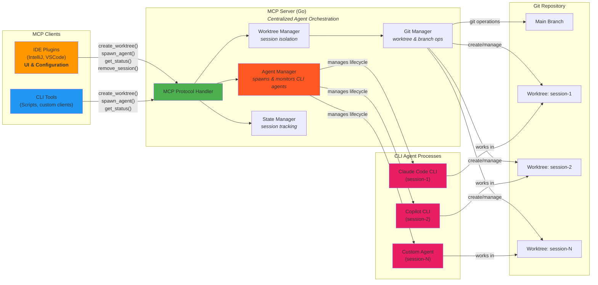

# Architecture

## System Overview



## Workflows

**MVP (Current - Session Management):**
1. Client calls `create_worktree(sessionId)` → Server creates worktree + branch
2. Developer/agent works in isolated worktree manually
3. Developer reviews: `cd .worktrees/orchestrAIgent-{sessionId} && git diff`
4. Developer merges manually: `git merge orchestrAIgent-{sessionId}`
5. Cleanup: `remove_session(sessionId, force=false)`

**Future (Full Agent Orchestration):**
1. **Spawn:** Client calls `spawn_agent(sessionId, agentType, command, env)`
   - Server creates worktree + branch via `create_worktree`
   - Server spawns CLI agent process (Claude Code CLI, Copilot CLI, etc.)
   - Agent process runs in isolated worktree with restricted filesystem access
2. **Monitor:** Agent works autonomously, server tracks status
   - Client polls `get_agent_status(sessionId)` → returns status, logs, progress
3. **Review:** Developer reviews changes via IDE 
4. **Merge:** Developer approves merge via UI
5. **Cleanup:** Server terminates agent process and cleans up session
   - `remove_session(sessionId)` → removes worktree + branch

## Design Principles

- **Centralized Orchestration:** MCP server handles all agent lifecycle management (spawn, monitor, terminate) for maximum reusability across clients (CLI, IntelliJ, VSCode)
- **Protocol-First:** All functionality exposed via MCP tools, usable by any MCP-compatible client
- **Human-in-the-Loop:** Critical operations (merge, delete) require explicit human approval
- **Process Isolation:** Each agent session gets dedicated worktree + branch + process
- **CLI-Agent Focus:** Designed for CLI-based agents (Claude Code CLI, Copilot CLI, custom tools) rather than IDE-native integrations
- **Progressive Enhancement:** MVP (manual workflows) → Full orchestration (automated agent management)

---

## Responsibility Boundaries

### MCP Server Owns

**Session Management:**
- Create/remove isolated git worktrees and branches
- Track session state (active, completed, failed)

**Agent Orchestration:**
- Spawn CLI agent processes (Claude Code CLI, Copilot CLI, etc.)
- Monitor agent status, logs, and resource usage
- Terminate agent processes
- Manage agent environment (working directory, env vars)

**Git Operations:**
- Worktree creation/deletion
- Branch management
- Merge execution and conflict detection
- Test execution in isolated environments

**State Persistence:**
- Session metadata (sessionId, worktreePath, branchName, status)
- Agent process information (PID, command, environment)
- Execution history and logs

### IDE Plugin Owns

**User Interface:**
- Display session list, status, and progress
- Show diffs, commits, and test results
- Merge conflict resolution UI
- Configuration dialogs

**Configuration Management:**
- Agent type selection (which CLI agent to use)
- Repository path configuration
- Test command configuration
- User preferences and credentials

**Workflow Orchestration:**
- Trigger MCP tools based on user actions
- Handle MCP responses and update UI
- Provide IDE-specific integrations (e.g., open files, jump to code)

**Decision:** For CLI-based agents, the MCP server handles spawning. For IDE-native agents (future consideration), plugins handle directly using IDE APIs.

---

## Clean Architecture

### Layer Organization

Dependencies flow **inward** toward the domain:

```
Adapters (MCP handlers, CLI)
    ↓ depends on
Application (Use Cases: CreateWorktree, RunTests, MergeToMain)
    ↓ depends on
Domain (Entities: Agent, Worktree | Interfaces: GitOperations, AgentRepository)
    ↑ implemented by
Infrastructure (GitClient, InMemoryRepository, ProcessManager)
```

**Rules:**
- Domain has zero external dependencies
- Application depends only on domain interfaces
- Infrastructure implements domain interfaces
- Adapters translate external protocols to use cases

### Directory Structure

```
orchestrAIgent/
├── cmd/
│   └── server/main.go                   # MCP server entrypoint
├── internal/
│   ├── domain/                          # Pure business logic (zero deps)
│   │   ├── agent.go                     # Agent entity (session + process state)
│   │   ├── session_id.go                # SessionID value object
│   │   └── ports.go                     # Interfaces (GitOperations, AgentRepository, ProcessManager)
│   ├── application/                     # Use cases
│   │   ├── create_worktree.go           # CreateWorktreeUseCase (current)
│   │   ├── remove_session.go            # RemoveSessionUseCase (current)
│   │   ├── spawn_agent.go               # SpawnAgentUseCase (future)
│   │   ├── get_agent_status.go          # GetAgentStatusUseCase (future)
│   │   └── terminate_agent.go           # TerminateAgentUseCase (future)
│   ├── infrastructure/                  # Implements interfaces
│   │   ├── git/git_client.go            # GitClient implementing GitOperations
│   │   ├── process/process_manager.go   # ProcessManager for agent lifecycle (future)
│   │   └── persistence/in_memory_repository.go  # InMemoryAgentRepository
│   └── adapters/                        # External protocols
│       └── mcp/
│           ├── server.go                # MCP server setup
│           └── result.go                # MCP result helpers
├── test/integration/
├── config/config.example.yaml
└── docs/
```
